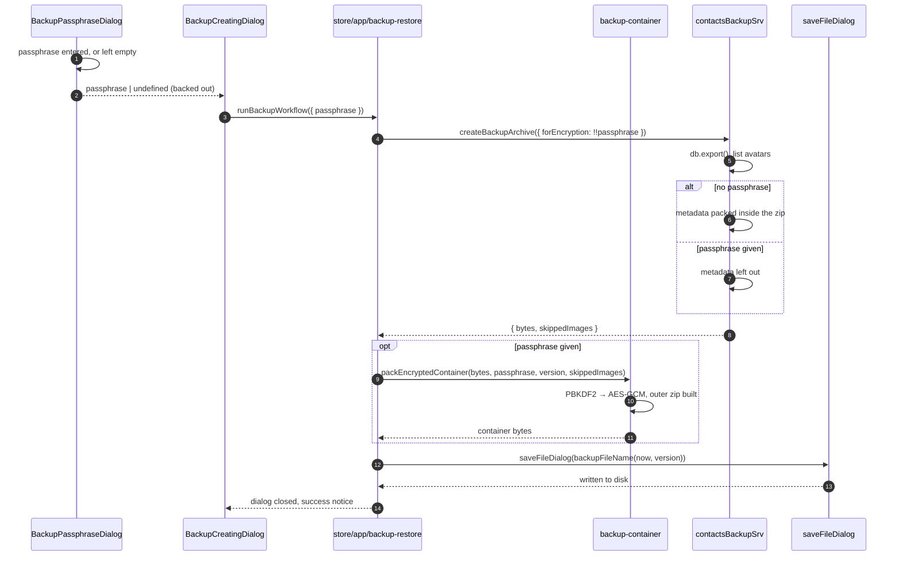
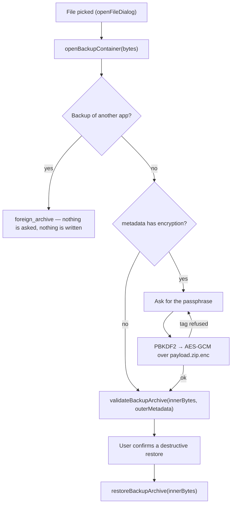

# Backup and restore

How the address book is exported to a portable archive, optionally protected by
a passphrase, and read back.

## 1. Where the work happens

Responsibilities are split across two layers, and the split is not arbitrary —
see [§1.1](#11-why-the-cryptography-lives-in-the-gui).

| Layer | Files | Owns |
|---|---|---|
| Deno service | [`src-deno/contacts-backup-srv.ts`](../src-deno/contacts-backup-srv.ts) | Reading and writing the db and the avatars, packing and unpacking the inner archive, synchronization |
| GUI | [`src/common/utils/backup-container.ts`](../src/common/utils/backup-container.ts), [`src/common/utils/backup-crypto.ts`](../src/common/utils/backup-crypto.ts) | The container, the metadata, encryption and decryption |

What both sides need — the constants, the metadata shape, the file name — lives
in [`src-deno/utils/backup-archive.ts`](../src-deno/utils/backup-archive.ts),
which imports neither fflate nor sqlite nor `w3n` so that it stays testable on
its own.

**The passphrase never crosses the ipc boundary.** The service is handed an
archive that is already decrypted, and knows nothing about passphrases.

### 1.1 Why the cryptography lives in the GUI

A component declared in the manifest as `runtime: "deno"` is **not** executed by
Deno on android. It runs under `androidx.javascriptengine`
(`JavaScriptSandbox` / `JavaScriptIsolate`), which is a bare V8 isolate with no
Web APIs — `crypto` is absent there entirely, `crypto.subtle` included. The
platform adds no polyfill: it bridges its own random number generator to the
native side and implements NaCl natively, precisely because the isolate has no
crypto of its own.

The GUI, by contrast, has WebCrypto on both platforms: on android the webview is
loaded over an `https` origin, and in electron the custom scheme is registered
with `secure: true`. Both give the secure context that `crypto.subtle` requires.

Hence the rule: **the service owns the data, the GUI owns the container and the
cryptography.**

If `crypto.subtle` is missing anyway, the passphrase dialog is not shown at all
and the archive is written unencrypted — a backup is never failed over it.

## 2. The archive

### 2.1 File name

`backupFileName()` puts the app version into the name:

```
contacts-backup-0_8_34-2026-09-05_14-30.zip
```

The dots of the version are replaced with `_` deliberately: a name like
`contacts-backup-0.8.34-…` reads as a file with a `.34-…` extension to file
dialogs and unpackers alike. A missing version drops the segment rather than
writing `undefined` into the name.

### 2.2 Unencrypted archive

```
contacts-backup-0_8_34-YYYY-MM-DD_HH-mm.zip
├── contacts_app_privacysafe_io.json    # metadata
├── contacts-db                         # the sqlite database
└── images/                             # avatars, stored without recompression
    └── <image-id>
```

```json
{
  "appDomain": "contacts.app.privacysafe.io",
  "version": "0.8.34",
  "formatVersion": 1,
  "createdAt": "2026-09-05T11:30:00.000Z",
  "contactsCount": 42
}
```

### 2.3 Encrypted archive

The container is two-layered. The outer zip holds exactly two entries:

```
contacts-backup-0_8_34-YYYY-MM-DD_HH-mm.zip
├── contacts_app_privacysafe_io.json    # metadata, always in the clear
└── payload.zip.enc                     # ciphertext of the inner zip, stored
```

The inner zip is the same set of entries as above, **without** the metadata
file. Nesting it as one opaque entry is what keeps an encrypted archive from
disclosing anything beyond its own metadata — not the number of contacts, not
even how many avatars there are. That is also why `contactsCount` is left out of
an encrypted archive's metadata.

```json
{
  "appDomain": "contacts.app.privacysafe.io",
  "version": "0.8.34",
  "formatVersion": 1,
  "createdAt": "2026-09-05T11:30:00.000Z",
  "encryption": {
    "alg": "AES-GCM", "keyLen": 256,
    "kdf": "PBKDF2", "hash": "SHA-256", "iterations": 250000,
    "salt": "<base64>", "iv": "<base64>"
  }
}
```

`skippedImages` may appear in either: it lists avatars whose bytes were still
only on the server when the backup ran, so that a contact without a picture
afterwards is explainable. Only the service knows what had to be left out, so it
returns the list alongside the archive bytes.

### 2.4 The cryptography

Implemented in [`backup-crypto.ts`](../src/common/utils/backup-crypto.ts) on
WebCrypto alone — no dependency is pulled in for it.

| | |
|---|---|
| Key derivation | PBKDF2-HMAC-SHA-256, 250 000 iterations |
| Salt | 16 random bytes, kept in the metadata (it is not secret) |
| Encryption | AES-GCM, 256-bit key |
| IV (nonce) | 12 bytes — the size AES-GCM is specified for |

Four details that matter:

1. **The iteration count is read from the archive**, not from the constant.
   Otherwise raising the cost of the KDF later would make today's archives
   unreadable.
2. **A wrong passphrase is AES-GCM refusing the tag.** There is no separate
   canary, and no way to tell a wrong key from tampering.
3. **Salt and iv come straight from `crypto.getRandomValues`**, not through the
   shared `randomBytes()`, which falls back to `Math.random()` when crypto is
   missing. That fallback is fine for an id and unacceptable for a salt or a
   nonce, so a missing entropy source is an error here.
4. **A forgotten passphrase cannot be recovered.** The archive stays unreadable,
   by construction.

## 3. Creating a backup

The passphrase is settled *before* the work starts: the archive is packed and
encrypted in one pass, with nothing left to ask for afterwards.



Notes on packing:

- Only the **synchronous** fflate api is used. The asynchronous one spins up a
  worker through `URL.createObjectURL`, which neither the deno component nor the
  webview can be relied on to provide. Streaming through `Zip` still reports
  progress per entry, which a single `zipSync` call could not.
- The database is exported from memory rather than read off the file: the
  service holds it open, so the file lags behind whatever has not been saved
  yet, and on a device whose bytes are still only on the server reading it fails
  outright.
- Ciphertext does not compress, so `payload.zip.enc` is stored, not deflated.
- One unreadable avatar does not fail a backup — it goes into `skippedImages`.
- Cancellation goes through an `AbortController`; the loops check it per entry,
  so it lands between entries rather than only at the ends.

## 4. Reading an archive

The GUI opens the container first, asking for a passphrase as many times as the
user is willing to try — a mistyped one is a slip, not a reason to start over —
and only then hands the decrypted bytes to the service.



### 4.1 Compatibility

A restore is gated on **`formatVersion`, not on the app version**:
`checkBackupFormatCompatibility()` compares strictly, and an archive without the
field is not compatible. `checkBackupVersionCompatibility()` is secondary — its
answer only picks the wording of the warning.

Archives written before `formatVersion` existed can still be restored, but only
past the "Restore anyway" warning.

### 4.2 Validation

Validation stays in the service, because counting the contacts means reading
`contacts-db` through sqlite. An encrypted archive keeps its metadata in the
container **outside**, which the service never sees, so the GUI passes that
metadata in as the second argument.

The avatars are tallied through fflate's `filter`: returning `false` leaves the
entry compressed, so they are counted without paying to decompress any of them.

| Result | Meaning |
|---|---|
| `corrupted_archive` | Not a zip, or damaged |
| `foreign_archive` | A backup of another privacysafe app |
| `no_contacts_db` | Unpacks, but holds no `contacts-db` |
| `unreadable_db` | The db is there but cannot be read |
| `passphrase_required` | Encrypted, and no passphrase was given |
| `wrong_passphrase` | AES-GCM refused the tag |
| `encryption_unsupported` | Encrypted, and this runtime has no `crypto.subtle` |

**Telling a foreign archive apart.** Every privacysafe app names its metadata
file after its own domain, so an entry matching `*_app_privacysafe_io.json` that
is not ours means a backup of another app (`isForeignAppMetadataPath`). The
check is needed rather than merely tidy: archives written before `appDomain`
existed carry no field to compare, and another app's entries look restorable on
their own — without it, a foreign archive would reach a destructive restore
behind nothing more than a compatibility warning. It runs **before** a
passphrase is asked for, and such an entry is refused a place in storage even if
an archive somehow got past it.

## 5. Restoring

`restoreBackupArchive()` replaces the address book with what the archive holds.

Guarantees worth knowing:

- `setRestoreInProgress(true)` is set before anything is read. It silences the
  debounced db upload, the sweep of unused avatars, and the remote-change
  handling that would otherwise rewrite the very table being replaced.
- Rows are brought to a shape the insert is certain to swallow **before** the
  table is touched — `updateContactsTable` DROPs the table before its first
  insert, so a row failing halfway would leave the address book truncated with
  no way back. Rows with no usable address are dropped, duplicates of one
  address are folded (the fresher wins), and the user's own contact is put back
  if the archive predates it.
- Entry names are checked for traversal (`../`, absolute paths) and desktop junk
  (`__MACOSX/`, `.DS_Store`) — the archive is a file the user picked.
- Entries this build has no place for are reported, never written.
- The restore dialog has **no cancel button**, unlike the one for creating a
  backup: there is nothing to roll a half-finished restore back to.

## 6. Progress

| Stage | Where it comes from | Shown as |
|---|---|---|
| `scanning` | service | *Reading the address book* |
| `compressing` | service | *Packing X of Y* |
| `encrypting` | **gui** | *Encrypting the archive* |
| `saving` | gui | *Saving the backup file* |
| `decrypting` | **gui** | *Decrypting the archive* |
| `unpacking` | service | *Reading the archive* |
| `restoring-images` | service | *Restoring image X of Y* |
| `restoring-contacts` | service | *Restoring X contacts* |
| `syncing` | service | *Synchronizing restored data* |
| `completed` | service | *Restoration completed* |

`syncDeferred` is not a failure: the data was restored on this device but
uploads were held because the root folder is not verified against the server
yet.

## 7. Tests

| Spec | Covers |
|---|---|
| [`tests/unit/src/common/utils/backup-crypto.spec.ts`](../tests/unit/src/common/utils/backup-crypto.spec.ts) | Round-trip, wrong passphrase, salt/iv never reused, unsupported parameters |
| [`tests/unit/src-deno/utils/backup-archive.spec.ts`](../tests/unit/src-deno/utils/backup-archive.spec.ts) | File name, safe paths, foreign metadata, metadata shape, restored rows |
| [`tests/unit/src/common/composables/use-backup-restore.spec.ts`](../tests/unit/src/common/composables/use-backup-restore.spec.ts) | The restore flow over real archives, including retrying a wrong passphrase |
| [`tests/unit/src/common/store/backup-restore.spec.ts`](../tests/unit/src/common/store/backup-restore.spec.ts) | The backup flow, and that the container is what gets saved |

The composable and store specs build real zips and run real PBKDF2 rather than
asserting against mocked verdicts, so the passphrase path is exercised end to
end. Deriving a key costs enough that those cases carry a raised timeout.
